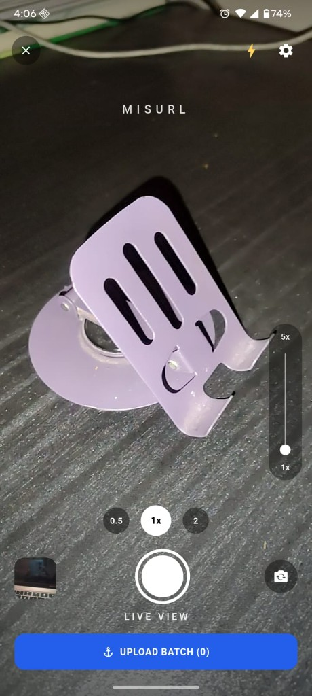
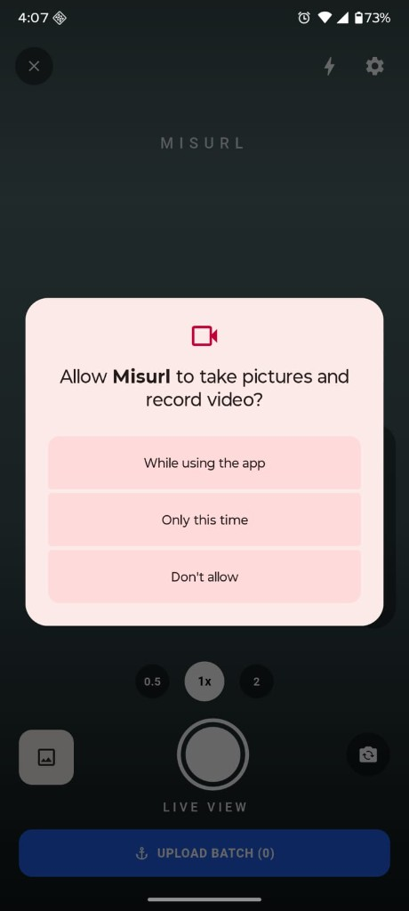
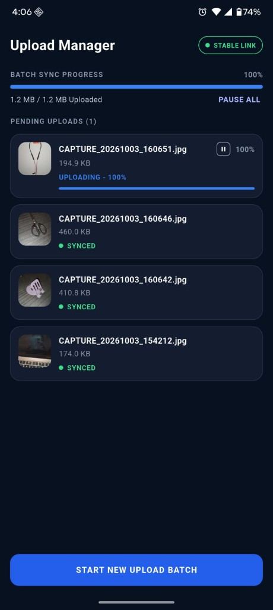

# Misurl: Offline-First Camera Sync

Misurl is a Flutter field camera for photo batches that cannot afford a dropped connection. You frame the shot on the live view, every capture is stored on the phone first, and a sync engine uploads one image at a time to the CamSync API. A failed upload stays in the local queue and goes out again when the link is stable, including after the app has been closed.

> Task 2 of the Senior App Developer Technical Assessment (Flutter).

## Features

- **Live view.** Full-screen camera preview with pinch zoom, a 1x–5x zoom rail, and **0.5 / 1x / 2** preset chips. Tap anywhere to set focus and exposure on that point. Flash (torch) and front / back switching sit in the top bar and next to the shutter.
- **Batch shutter.** Each capture is saved to the app documents folder as `CAPTURE_yyyyMMdd_HHmmss.jpg` and queued at once. **Upload Batch (n)** shows how many captures in the current batch are not synced yet, and the thumbnail shows the latest shot.
- **Upload Manager.** Batch progress in bytes and percent, a **Stable Link / No Link** pill, and one card per capture with its thumbnail, size, and status: `IN QUEUE`, `WAITING FOR CONNECTION`, `UPLOADING - n%`, `RETRYING... (ATTEMPT n/5)`, `SYNCED`, or `FAILED`.
- **Pause All / Resume All** holds the whole queue and cancels the upload in flight. The pause is stored, so it survives an app restart and also holds the background worker.
- **Start New Upload Batch** opens a fresh batch and returns to the live view. The previous batch keeps uploading.
- **Survives a dead link and a closed app.** The queue lives in SQLite. Android WorkManager drains the same queue about every 15 minutes, and again soon after a capture or when the link comes back.
- **Permissions and hardware.** Covers a denied and a permanently denied camera permission (with a shortcut to system settings), a device without a camera, and a camera without flash.

## Project Structure / Approach

Layered **BLoC (Cubit)** architecture. The UI calls Cubit methods and rebuilds from one state object per Cubit. `CameraCubit` owns the camera controller. `SyncCubit` owns the queue view, the link state, and the pause flag. Neither Cubit talks to HTTP or SQLite directly. They go through `CaptureRepository` and `SyncEngine`, and the same engine runs inside the WorkManager isolate. `interpretUpload` and `statusLabel` are pure Dart, so the retry rules and the card labels are unit-tested without a device.

```
lib/
├── main.dart              opens the database, schedules WorkManager, wires dependencies
├── app.dart               MultiBlocProvider + MaterialApp
├── bloc/
│   ├── camera/            CameraCubit, CameraState
│   └── sync/              SyncCubit, SyncState
├── data/
│   ├── api/               CamSyncClient (dio), UploadResult + interpretUpload
│   ├── db/                SyncDatabase (sqflite schema)
│   ├── model/             QueuedImage, QueueStatus
│   ├── repository/        CaptureRepository (queue, claims, retries, meta)
│   └── image_compress.dart  shrinks captures over the upload limit
├── service/
│   ├── sync_engine.dart   one-at-a-time upload loop
│   └── background_sync.dart  WorkManager periodic and one-off tasks
├── core/                  API config, colours, ids, byte format, status labels
└── ui/
    ├── camera/            live view and controls
    └── upload/            Upload Manager screen, dashboard, upload card
```

### Tech stack

Flutter, Dart, flutter_bloc, camera, permission_handler, sqflite, dio, connectivity_plus, workmanager, image, path_provider, uuid, equatable, flutter_test.

## Technical notes

### Camera

`CameraCubit.start` requests `Permission.camera`, picks the first back lens, and opens a `CameraController` at `ResolutionPreset.high` with audio off. Each open bumps a generation counter, so a slow `initialize()` from a camera switch cannot overwrite a newer controller.

Zoom always goes through `setZoom`, which clamps to the lens's `getMinZoomLevel` / `getMaxZoomLevel`:

```
pinch:   zoom = zoomAtPinchStart * scale
slider:  zoom = 1 + t * (sliderMax - 1)     t in 0..1
chips:   zoom = 0.5, 1, or 2 (clamped to what the lens supports)
```

Tap-to-focus passes the normalised tap point to both `setFocusPoint` and `setExposurePoint`. The shutter fires a haptic, calls `takePicture`, and hands the file to `CaptureRepository.saveCapture`. It then pokes `SyncCubit.pump()` and schedules a one-off background task, so a new capture starts uploading right away.

### Saving a capture

`saveCapture` moves the photo into `documents/captures/`, deletes the camera's temp file, and inserts one row in the `images` table with status `queued`. Each row carries:

- `client_image_id`: `img_<uuid>`, created once on the phone, used by the server to spot duplicates.
- `batch_id`: the active batch, stored in the `meta` table.
- `device_id`: `dev_<uuid>`, created on first launch.
- `captured_at`: UTC ISO-8601.

The host accepts at most 8 MB. A capture over 7 MB is decoded in a background isolate (`compute`), resized to at most 1600 px wide at JPEG quality 82, and shrunk by 20 % at quality 68 for up to four passes until it fits under the limit with 256 KB to spare.

### Local queue

`SyncDatabase` opens `misurl.db` with two tables.

| Table | What it holds |
|---|---|
| `images` | one row per capture: ids, file path and name, bytes, status, attempt, progress, `error_code`, `remote_url`, `claimed_at`, `next_attempt_at` |
| `meta` | `device_id`, `active_batch`, `sync_paused` |

An index on `(status, next_attempt_at, created_at)` keeps the "next row to upload" query cheap. `CaptureRepository` broadcasts a change event after every write, and both Cubits reload from it, so the database is the single source of truth.

### Sync engine

`SyncEngine.drain` runs in this order:

1. **Recover stale claims.** A row stuck in `uploading` for more than 3 minutes (for example, the app was killed mid-upload) goes back to `queued`.
2. **Reconcile.** For every batch with unsynced rows, `GET /api/v1/batches/{batch_id}` lists what the server already stored, and those rows are marked synced. A capture that landed before a crash is not uploaded again. A reconcile failure is ignored and never clears the queue.
3. **Health check.** `GET /api/v1/health` must return `200` with `ok: true`. Otherwise the drain stops and nothing is touched.
4. **Upload loop.** While not paused: claim the oldest `queued` or `retrying` row whose `next_attempt_at` has passed, post it, record the result, repeat.

The claim runs in a SQLite transaction and only updates a row that is still `queued` or `retrying`. The foreground app and the WorkManager isolate can therefore both drain without uploading the same row twice.

The upload is `POST /api/v1/images` as multipart: `file`, `client_image_id`, `batch_id`, `device_id`, `captured_at`, with the `X-Api-Key` header. `onSendProgress` updates the card and the row, at most once per 2 % step.

### Upload result rules

`interpretUpload` maps every response onto one of four outcomes:

| Response | Outcome |
|---|---|
| `200` or `201` (including `duplicate: true`) | synced, store `image.url` |
| no response (timeout, DNS, socket) | retry |
| `500` and above | retry |
| `400` with `retryable: true`, `partial_upload`, or `upload_failed` | retry |
| `401`, `413`, `415` | stop, mark failed |
| any other `4xx` | stop, mark failed |
| request cancelled by Pause All | release the claim back to `queued` |

A retry increments `attempt` and sets `next_attempt_at` with exponential backoff:

```
delay = clamp(2^attempt, 2, 60) seconds
```

Retries never give up on their own. The card shows the attempt count capped at 5 (`ATTEMPT 5/5`), but a retryable error keeps the row in the queue until it is accepted. A missing local file is marked failed with `missing_file`.

### Link state and progress bar

`SyncCubit` listens to `connectivity_plus`. "Online" only means a network interface is up. **Stable Link** means online and the health check passed. When the link becomes stable, the Cubit drains the queue and also schedules a one-off WorkManager task. A 12-second timer re-checks the link while anything is pending or the link is down.

Batch progress is computed from bytes, not from image count:

```
uploaded = sum(bytes of synced rows) + sum(bytes * progress / 100 of uploading rows)
fraction = uploaded / sum(bytes of all rows)
```

`pump()` never runs two drains at once. A request that arrives during a drain sets a flag, and the drain loops once more after it finishes.

### Background sync

`registerBackgroundSync` registers a periodic WorkManager task (`misurl-periodic`, every 15 minutes, network required, exponential backoff from 30 seconds). `kickBackgroundSync` adds a one-off task (`misurl-once`) after each capture and whenever the link turns stable. The `callbackDispatcher` opens its own database connection and runs the same `SyncEngine.drain`, so the closed app follows exactly the same rules as the open one.

## Tests

`flutter test`

- `sync_rules_test.dart`: byte formatting for the cards, status labels online and offline, and the upload rules (`201` and duplicate `200` synced, retryable `400`, `503`, and transport errors retried, `401` and `415` stopped).
- `widget_test.dart`: the Upload Manager renders the header, Stable Link pill, Pause All, pending count, an `IN QUEUE` card, and Start New Upload Batch.

## Generative AI Usage

An AI coding assistant (Cursor) was used as a pair programmer. The queue design, the idempotency rule, and the upload status rules were reviewed and adjusted by hand. AI was not left to invent the acceptance rules.

1. The assessment PDF and the CamSync API README were turned into acceptance criteria: batch capture, local queue, idempotent upload, retry on a bad link, and sync with the app closed.
2. The bloc / data / service split was drafted, then kept to Cubits and plain constructor injection, with one `SyncEngine` shared by the app and the WorkManager isolate.
3. The camera screen, the upload cards, and the tests were drafted and then corrected when the behaviour was wrong (duplicate uploads from two drains, stuck `uploading` rows after a kill, progress jumping backwards).

Essential prompts:

- *"Build the Task 2 Flutter camera and sync engine against `https://munjuralam.com/camsync`. Keep the queue idempotent and match the supplied camera and upload-manager mock."*
- *"`200` and `201` are done, retryable failures stay queued, `401`, `413`, and `415` stop that file."*
- *"WorkManager must drain the same SQLite queue as the open app, and two drains must never upload the same row."*
- *"Match the live view and the upload cards to the mock pixel by pixel."*
- *"Write the README as interview documentation: camera, local queue, sync engine, upload rules, link state, progress math, and background sync."*

## How to Run

**Requirements:** Flutter 3.47 or newer (Dart 3.12+), Android Studio or the Android SDK, and a physical Android device with a camera (the emulator camera works, but a real lens is better for zoom and focus).

1. Clone the repo.
   ```bash
   git clone https://github.com/Monjur-Alam/CamSync.git
   cd CamSync
   ```
2. Check the API settings in `lib/core/config/api_config.dart`. `apiKey` must match `config.php` on the host. Rotate that key if this repository is public.
3. Install packages and run:
   ```bash
   flutter pub get
   flutter run
   ```
4. Release APK:
   ```bash
   flutter build apk --release
   ```
   The APK is written to `build/app/outputs/flutter-apk/app-release.apk`.

Grant the camera permission when Android asks. To see the retry path, turn on airplane mode, take a few shots, open Upload Manager (cards show `WAITING FOR CONNECTION`), then turn the network back on and watch them upload. To see background sync, close the app while offline, reconnect, and reopen it later: the batch is already synced.

## Screenshots

| Live view | Camera permission | Upload Manager |
|---|---|---|
|  |  |  |
